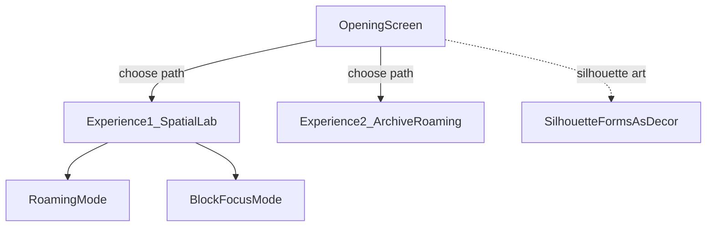

# Experience model — opening, laboratory, archive roaming

**Status:** Product architecture doc (2026-07-05). Opening screen and Experience 2 are **planned**, not built.

**Parent brief:** [`AGENTS.md`](../../AGENTS.md)

---

## Purpose

The site is a **laboratory** for exploring how people use mobile notes — a platform to investigate, explore, and learn. Visitors express **nosiness** through unconventional filtering and digital roaming to snoop through a live note archive. The frame is **ceremonial**: a chance to see into the human mind through its words.

The product is structured in three parts:

1. **Opening screen** — threshold and invitation
2. **Experience 1 — Spatial laboratory** — the current build (active)
3. **Experience 2 — Archive roaming** — a complementary path (planned)



---

## Opening screen

**Status:** `active` — ceremonial entry with silhouette art and single Continue into Experience 1.

### Role

Ceremonial entry before any experience. Sets the tone and the rules of looking — what it means to peer into someone else's phone notes. Visitor taps **כניסה** to enter the spatial laboratory (Experience 1). Experience 2 remains reachable via the in-app experience switch after entry.

### Silhouette art

Typographic **silhouette forms** from the note archive appear as **abstract decorative elements** on the opening screen — artistic shapes, not readable notes.

| Aspect | Intent |
|--------|--------|
| **Source geometry** | SVG `path` data from `SilhouetteEngine` (`.meso-silhouette__shape`) — measured from each note's title/body layout |
| **Data pipeline** | Prefer cached paths from `js/meso-silhouette-cache.js` or a pre-baked subset; avoid re-measuring live notes on every load when cache exists |
| **Treatment** | Scaled, scattered, layered, or animated — design TBD; no note text visible on opening |
| **Tone** | Abstract traces of human writing — ghostly, curious, ceremonial |

Code reference (meso host markup):

```
js/silhouette-engine.js   — measurement + path generation
js/meso-silhouette-cache.js — optional pre-baked cache
```

Visual tokens: [`docs/visual-language.md`](../visual-language.md) — Opening screen section. Dev bypass: `?skipOpening=1` (localStorage); reset with `?opening=1`.

### Out of scope (future)

- Second path button on opening (Experience 2 entry from threshold)
- Return-to-opening from inside experiences

---

## Experience 1 — Spatial laboratory

**Status:** `active` — this is the full current build.

### What exists today

| Capability | Glossary / code |
|------------|-----------------|
| L1 macro — physics dots, molecules, hulls | `.layer-dot`, `bodiesData`, `strokeHullOutline` |
| L2 micro — full readable notes grid | `MicroMock`, `.micro-grid-column`, `DepthController` |
| Depth zoom — L1 ↔ L2 | `DepthController`, `activeLevels: [1, 3]` (micro = code level 3), `depth-v2.js` |
| Silhouette engine (opening-screen art only) | `SilhouetteEngine`, `meso-silhouette-cache.js` |
| Blocks, warehouse, surface capture | `ActionWarehouse`, `noteAnchors`, `updateOrbits` |
| Inspector — single-note focus popup | `ArtifactInspector` |
| Edge scroll, minimap, layer navigation | `SpatialNavigation`, `navigation-map.js` |

See [`AGENTS.md`](../../AGENTS.md) glossary for full term definitions.

### Two modes inside Experience 1

Experience 1 keeps two complementary ways to use the spatial laboratory:

| Mode | Former name | Reframed meaning |
|------|-------------|------------------|
| **Roaming** | Discovery | Curiosity-driven snooping — notes surface through motion, proximity, and aimless roaming |
| **Focus** | Study | Intentional investigation — blocks, tags, capture, and depth zoom toward specific topics |

Both modes share the same canvas, two depth levels (**L1** macro / **L2** micro), and data pipeline. Blocks and capture tilt the visitor toward focus; roaming without blocks keeps the field open.

### Depth and silhouettes

Legacy meso typographic silhouettes are **not** a navigable depth level; geometry is built for **opening-screen art** only. **L2** micro grid is the deep readable layer. See [`depth-v2.md`](depth-v2.md).

---

## Experience 2 — Archive roaming

**Status:** `planned` — design TBD.

### Intent

A **second, different way** to roam the same note archive — complementary to Experience 1's spatial physics laboratory. Where Experience 1 uses unconventional spatial filtering (blocks, orbits, stretch, depth zoom), Experience 2 should offer its own roaming and snooping mechanics.

### Open questions (future work session)

- What is the primary navigation metaphor? (timeline, stream, index, map variant, typology lanes, etc.)
- How does filtering differ from blocks/tags in Experience 1?
- Does Experience 2 share L2 micro depth, or stay at a single presentation layer?
- Entry/exit: return to opening screen, or cross-link from Experience 1?
- Ceremonial tone: same threshold rules, or a different "room" in the laboratory?

Start a work session from [`docs/work/session-template.md`](../work/session-template.md) when ready to brainstorm.

---

## Relationship to other docs

| Doc | Link |
|-----|------|
| Project goal, glossary | [`AGENTS.md`](../../AGENTS.md) |
| L2 micro grid, silhouette legacy | [`depth-v2.md`](depth-v2.md) |
| Exhibition chrome, planned opening tokens | [`visual-language.md`](../visual-language.md) |
| Physics stability (Experience 1) | [`CHECKPOINT.md`](../CHECKPOINT.md) |
