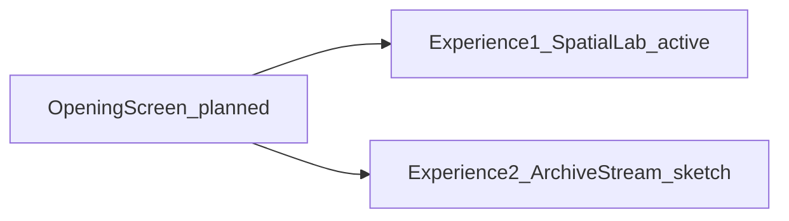

# External agent brief — עקבות

**Purpose:** Onboard an external AI agent (outside Cursor) with project essence, history, current state, and technical facts that are easy to miss.

**Last updated:** 2026-07-05

**Canonical docs in repo:** [`AGENTS.md`](../AGENTS.md) · [`docs/DOC-INDEX.md`](DOC-INDEX.md) · [`docs/architecture/experience-model.md`](architecture/experience-model.md)

---

## 1. Essence and goals

**עקבות** (working title: *Alternative Index*) is a Bezalel Academy visual communication graduation project (year 4). It is **not** a generic notes app or institutional archive.

| Idea | Meaning |
|------|---------|
| **Laboratory** | Explore how people use **mobile phone notes** — investigate, learn, observe patterns |
| **Nosiness** | Visitors are invited to **snoop** through a live personal note archive via unconventional filtering and digital roaming |
| **Ceremonial** | A threshold for seeing into the human mind through its words — respectful but curious |
| **Craft** | Slick, fun, well designed — spatial and rewarding, not cold or faux-archival |

**Content:** Hebrew personal notes from phones (title, body, ID, tags, author, typology). **UI is Hebrew RTL.** Agent/docs/code comments are **English**. Do not translate note data or Hebrew UI strings unless explicitly asked.

**Audience:** Frontal exhibition on a **21.5″ iMac @ 1920×1080**. Offline-capable. Print is out of scope.

---

## 2. Product architecture (three parts)



| Part | Status | Summary |
|------|--------|---------|
| **Opening screen** | **Planned** | Ceremonial entry; typographic **silhouette art**; choose Experience 1 or 2. No dedicated screen in production yet — today users land directly in Exp 1 or enter Exp 2 via switch/URL. |
| **Experience 1 — Spatial laboratory** | **Active** | Matter.js physics (L1), full notes grid (L3), blocks/warehouse, capture, inspector. Default on load. |
| **Experience 2 — Archive stream (זרם עקבות)** | **Rough sketch** | Vertical scroll stream + tag/author/typology filter dock. Separate canvas `#archive-roam`. Switchable without full reload. |

---

## 3. History (condensed)

| When | What happened |
|------|----------------|
| **2026-06** | Stable physics/navigation baseline documented in [`docs/CHECKPOINT.md`](CHECKPOINT.md) — RTL scroll, secondary grid, stretch, hull collision, 4–7 block tuning |
| **2026-06-25** | Layout/boot reference — blank-screen fixes, boot order, `VISUAL_SCALE` era |
| **2026-07-03** | Exhibition visual redesign — 24×12 shell grid, warehouse dock/map, layer nav, typography tokens ([`docs/visual-language.md`](visual-language.md)) |
| **2026-07-05** | **Product reframe:** study platform → mobile-notes **laboratory** + ceremonial/nosiness framing ([`AGENTS.md`](../AGENTS.md)) |
| **2026-07-05** | **L2 meso removed** from navigation — only **L1 ↔ L3** zoom in Experience 1 (`activeLevels: [1, 3]`). L2 silhouette code kept for **opening-screen art** only |
| **2026-07-05** | Pre-redesign snapshot: Git branch `archive/2026-07-05-pre-redesign` + local `my-website-old` |
| **2026-07-05** | **Experience 2 sketch:** `ExperienceRouter`, `ArchiveStream`, `ArchiveIndex`, `#archive-roam` in `index.html`, switch buttons (מעבדה מרחבית ↔ זרם עקבות) |

---

## 4. Current state (what is built today)

### Experience 1 — Spatial laboratory

- **L1 macro:** Tag dots, molecules, convex hulls, sibling links, edge scroll, minimap, warehouse blocks
- **L3 micro:** Scrollable grid of readable notes (`MicroMock`, `.micro-grid-column`) — wheel zoom L1↔L3 only
- **Blocks:** Drag from warehouse to surface; matching notes capture/orbit/stretch (max **5 blocks** on surface — [`docs/block-cap-policy.md`](block-cap-policy.md))
- **Inspector:** Popup focus for a single note (`ArtifactInspector`) — optional on L3 click
- **Layer nav:** Two buttons — **מאקרו** / **מיקרו** (levels 1 and 3)

### Experience 2 — Archive stream (sketch)

- Entry: `?exp=archive`, `#archive`, `sessionStorage.experiencePath`, or UI switch **זרם עקבות**
- Modules: `js/experience-router.js`, `js/archive-stream.js`, `js/archive-index.js`
- UI: Vertical list of note cards, filter chips (tags / author / typology), progress bar, tuning dock
- Reuses `MicroMock` card HTML; **does not** use L1 physics or block warehouse
- Exit: switch back to **מעבדה מרחבית**

### Opening screen

- **Not implemented.** Planned: silhouette SVG art from `SilhouetteEngine` / cache; path choice. See [`docs/work/2026-07-05-opening-screen-plan.md`](work/2026-07-05-opening-screen-plan.md).

### Depth levels (important)

| Level | Name | Navigable? | Role today |
|-------|------|------------|------------|
| **L1** | Macro | Yes | Physics dots, spatial roaming |
| **L2** | Meso | **No** | Legacy silhouettes / MesoMock — **dead path** in UX; geometry kept for opening art |
| **L3** | Micro | Yes | Full note grid (Exp 1) or archive stream presentation (Exp 2 uses `view-level-3` class) |

Config: `CONFIG.depth.activeLevels: [1, 3]`, `maxLevel: 3`. Wheel zoom skips L2 via `getDepthAdjacentLevel()`.

---

## 5. Technical stack

| Layer | Technology |
|-------|------------|
| Host | Static HTML — `index.html`, `styles.css` |
| Logic | Vanilla JS modules in `js/*.js` → bundled to **`js/app.js`** via `./build-js.sh` |
| Config | **`js/config.js` loads separately** — not part of the bundle; edit + refresh, no build |
| Physics | Matter.js — **`vendor/matter.min.js`** (local, no CDN — exhibition offline) |
| Data | Google Sheets CSV (remote) + **`data/main.csv`**, **`data/tags.csv`** (local fallback) |

**Live site:** https://roilempert.github.io/my-website/ — manual GitHub Actions deploy ([`docs/DOC-INDEX.md`](DOC-INDEX.md)).

---

## 6. Repository layout (mental map)

```
index.html          # #app (spatial) + #archive-roam (stream); loads config.js then app.js
styles.css          # ~4.7k lines — exhibition chrome + L1/L2/L3/archive rules
js/config.js        # CONFIG, VISUAL_SCALE, site grid, depth, data URLs — EDIT DIRECTLY
js/app.js           # BUNDLED — do not edit; run ./build-js.sh after js/*.js changes
js/bootstrap.js     # DOMContentLoaded entry; ExperienceRouter branches spatial vs archive
js/app-state.js     # Data fetch, note render, boot finish, viewport centering
js/physics-engine.js
js/warehouse-*.js   # core, grid, filter, orbit
js/depth-*.js       # controller, v2, transitions, focus links
js/experience-router.js
js/archive-stream.js / archive-index.js
js/silhouette-engine.js / meso-silhouette-cache.js  # opening art + legacy L2 geometry
js/micro-mock.js    # L3 note card DOM
docs/               # CHECKPOINT, visual-language, architecture, work sessions
data/               # local CSV fallback
vendor/matter.min.js
```

---

## 7. Build and edit rules (often missed)

1. **Never edit `js/app.js` by hand** — changes are overwritten by `./build-js.sh`.
2. **`js/config.js` is standalone** — saved in browser separately; cache-bust not automatic on config-only edits (hard refresh).
3. After any `js/*.js` module edit (except config): run **`./build-js.sh`** — updates `app.js` and `index.html?v=` cache bust.
4. **Do not commit secrets** — sheet URLs are public publish links, not credentials.

---

## 8. Boot sequence (critical)

Order in `js/bootstrap.js`:

```
DOMContentLoaded
  applyPresentationProfile()     # low-end / localhost throttling
  applyVisualScaleTokens()
  applySiteGridTokens()
  ExperienceRouter.initEarly()   # ?exp=archive | sessionStorage → spatial vs archive
  ExperienceRouter.bootSpatialShell() OR bootArchiveShell()
  AppState.init()              # async CSV fetch → render notes
    → finishBoot() / finishArchiveBoot()
    → ExperienceRouter.mountSpatialSwitch()  # spatial only
```

**Race to avoid:** `ActionWarehouse.populate()` must run **after** `ActionWarehouse.init()`. Early populate caused blank screens (documented in [`docs/REFERENCE-2026-06-25-layout-boot.md`](REFERENCE-2026-06-25-layout-boot.md)).

**Resilience:** `CONFIG.boot.fetchTimeoutMs` (15s), `safetyRevealMs` (10s) — reveals UI even if sheet fetch hangs.

---

## 9. RTL, layout, and grids (often missed)

| Rule | Detail |
|------|--------|
| **Document** | `<html lang="he" dir="rtl">` |
| **Canvas** | `#app { direction: ltr }` — physics x/y and scroll math assume LTR canvas |
| **Notes** | `.note-card { direction: rtl }` — readable Hebrew inside cards |
| **Shell grid** | **24×12** viewport reference (`CONFIG.siteGrid`) — warehouse rows 11–12, canvas rows 1–10 |
| **Canvas grids** | Wider than viewport (`#app` macro ~180vw+, L3 micro grid in `CONFIG.depth.v2.micro`) — **not** the 24×12 shell |
| **VISUAL_SCALE** | **`1.0`** on exhibition iMac (was `0.72` in older reference docs) — see `js/config.js` + [`docs/visual-language.md`](visual-language.md) |
| **Spacing** | Prefer `--space-*` tokens and `--site-grid-*` over raw px in chrome CSS |

---

## 10. Navigation and scroll (do not break)

Read [`docs/CHECKPOINT.md`](CHECKPOINT.md) before physics/navigation changes.

| Pattern | Rule |
|---------|------|
| **Center viewport** | `scrollBy` + delta from `getBoundingClientRect` — **not** `scrollTo(Math.max(0, …))` |
| **Clamp** | `getViewportClampLimits()` — viewport-relative |
| **constrainScrollPosition** | Disabled during block drag, pan, edge scroll |
| **Stretch layout** | Single pass: `ensureStretchBinding` → `assignStretchSlotLanes` → `layoutStretchedFromBinding` |
| **Orbit while dragging** | `smoothOrbitTargets` with `dragBlock` lerp — no hard snap on shared stretch |

---

## 11. Data model

Each **note** (`item` / `.note-wrapper`):

- `id`, `title`, `body`, `authorCode`, `date`, `typology` (Block / List / Fragment / Stanza)
- `tags[]` — `{ name, color }` from tag dictionary sheet
- `textDirection` — auto or CSV override (`ltr` / `rtl`)

**Tag dictionary:** `data/tags.csv` or remote tags sheet → `tagColorsMap`.

**Typology:** Pattern underlines on warehouse blocks (solid / dashed / dotted / wavy).

---

## 12. Experience routing API

| Mechanism | Value |
|-----------|--------|
| URL query | `?exp=archive` or `?exp=spatial` (also `stream`, `lab`) |
| Hash | `#archive` |
| Session | `sessionStorage.experiencePath` = `'archive'` \| `'spatial'` |
| Default | Spatial laboratory |

Switching modes: `ExperienceRouter.switchTo('archive'|'spatial')` — no full page reload; toggles `#app` vs `#archive-roam`, body classes `experience-spatial` / `experience-archive`.

---

## 13. Silhouettes and L2 legacy

- **`SilhouetteEngine`** measures title/body layout → SVG paths (`.meso-silhouette__shape`)
- **`meso-silhouette-cache.js`** — optional pre-baked cache
- **L2 MesoMock / p5 gradients** — still in bundle but **not reachable** via depth nav
- **Future:** Opening screen displays silhouette paths as **abstract art** (no readable text)

---

## 14. Exhibition and performance

- Target: **21.5″ iMac, 1920×1080**, fullscreen
- `CONFIG.presentation` — auto low-end profile on weak hardware (reduced physics FPS, hull cull, etc.)
- Block surface cap: **5** (policy doc) — physics tuned to 4–7 in CHECKPOINT but UI caps at 5
- Launcher: [`EXHIBITION-START-HERE.txt`](../EXHIBITION-START-HERE.txt)

---

## 15. What agents should read first

| Task | Read |
|------|------|
| Any work | [`AGENTS.md`](../AGENTS.md) |
| Physics / scroll / blocks | [`docs/CHECKPOINT.md`](CHECKPOINT.md) |
| UI tokens / colors / type | [`docs/visual-language.md`](visual-language.md) |
| Depth / L3 grid | [`docs/architecture/depth-v2.md`](architecture/depth-v2.md) |
| Product three-part model | [`docs/architecture/experience-model.md`](architecture/experience-model.md) |
| Opening screen plan | [`docs/work/2026-07-05-opening-screen-plan.md`](work/2026-07-05-opening-screen-plan.md) |
| Experience 2 plan | [`docs/work/2026-07-05-experience-2-archive-roaming-plan.md`](work/2026-07-05-experience-2-archive-roaming-plan.md) |

---

## 16. Common mistakes for external agents

1. Treating L2 meso as a live zoom level — **it is not**; only L1 and L3.
2. Editing `js/app.js` instead of source modules + rebuild.
3. Forgetting `./build-js.sh` after module changes.
4. Using `scrollTo(0, …)` clamping and breaking RTL wide-canvas centering.
5. Translating Hebrew note content or UI strings to English.
6. Assuming three depth buttons — layer nav has **two** (מאקרו, מיקרו).
7. Confusing **site shell grid** (24×12 viewport) with **canvas grids** inside `#app`.
8. Adding CDN dependencies — exhibition runs **offline**; Matter.js is vendored.
9. Assuming opening screen exists — it is **planned**; routing is URL/switch for now.
10. Breaking Experience 1 when working on Experience 2 — archive mode uses separate DOM root and router, but shares `AppState.items` and inspector.

---

## 17. Glossary (short)

| Term | Meaning |
|------|---------|
| **Note** | One row from sheet → `.note-wrapper` |
| **Dot** | Tag-colored physics body (L1) |
| **Molecule** | One note's dot cluster + links |
| **Block** | Warehouse pill dragged to surface to filter/capture |
| **Warehouse** | Bottom dock — blocks, stats, message, minimap |
| **Hull** | Rounded outline around a molecule |
| **Capture / orbit / stretch** | Block-driven note layout modes |
| **Inspector** | Single-note popup overlay |

Full glossary: [`AGENTS.md`](../AGENTS.md#glossary).

---

*This file is for external agents. Update it when product architecture or boot/routing changes significantly.*
